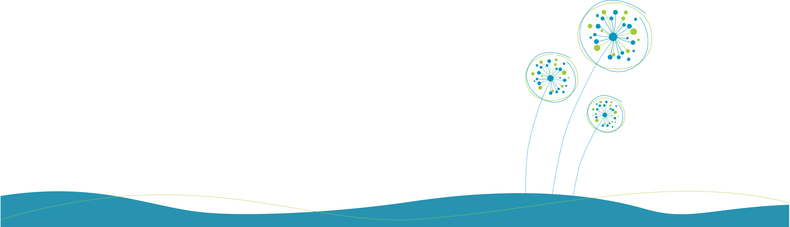

Powered by Vue.js v2 + Vuex, the AirSend UI brings great collaboration UI/UX for users.

## Requirements

* Node.js v14+
* NPM

## Setup

```bash
npm install --legacy-peer-deps
```

## Development Server

```bash
npm run serve
```

## Build

```bash
npm run build
```

## Contributing

AirSend is an open source project and we are super happy to accept your contribution.

To contribute, open a pull request with your changes explaining what are you fixing or implement, and how would that impact the application.

